# Documentação Técnica de Arquitetura — Sistema de Estacionamento Dom Pagamentos v2.0

> **Metodologia.** Este documento foi produzido por leitura integral do código-fonte presente no
> repositório em `2026-09-10` (commits até `9a1f3f6`), não a partir do `PROJECT_SPEC.md` ou de
> suposições sobre o que "deveria" existir. Toda afirmação é rastreável a um arquivo específico,
> citado como `caminho/arquivo.ext:linha`. Quando o código diverge do que o `PROJECT_SPEC.md`
> descreve como intenção, ou quando alguma informação não pôde ser determinada apenas pela leitura
> estática do código (comportamento de infraestrutura externa — Auth0, Railway, Evolution API —, ou
> decisões que dependem de acesso a esses painéis), isso é sinalizado explicitamente na seção
> [Limitações, Divergências e Perguntas em Aberto](#limitações-divergências-e-perguntas-em-aberto),
> em vez de ser assumido.
>
> Os diagramas estão em [PlantUML](https://plantuml.com/) válido, prontos para renderização (VS Code
> com a extensão PlantUML, IntelliJ, `plantuml.jar`, ou um servidor PlantUML). Cada bloco é
> autocontido (``@startuml``/``@enduml``).

## Sumário

1. [Visão geral da arquitetura](#1-visão-geral-da-arquitetura)
2. [Stack tecnológica](#2-stack-tecnológica)
3. [Backend](#3-backend)
4. [Frontend](#4-frontend)
5. [Banco de dados](#5-banco-de-dados)
6. [Infraestrutura e deploy](#6-infraestrutura-e-deploy)
7. [Diagramas UML obrigatórios](#7-diagramas-uml-obrigatórios)
8. [Diagramas de fluxo de dados](#8-diagramas-de-fluxo-de-dados)
9. [Limitações, divergências e perguntas em aberto](#limitações-divergências-e-perguntas-em-aberto)

---

## 1. Visão geral da arquitetura

O sistema é um **monólito modular de dois processos** (API + SPA), cada um empacotado como um
container Docker independente, acompanhado de dois serviços gerenciados (PostgreSQL/MySQL e Redis)
e integrações externas via HTTP com três SaaS (Auth0, Evolution API/WhatsApp, Resend/e-mail). Não há
microsserviços internos: todo o domínio de negócio (vagas, ocupantes, reservas, movimentações,
auditoria, administração) vive em um único processo FastAPI.

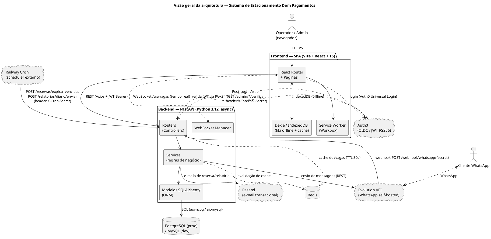

**Raciocínio de identificação:** a separação em dois processos é evidenciada por dois `Dockerfile`
distintos (`backend/Dockerfile`, `frontend/Dockerfile`) e dois serviços Railway distintos
(`backend/railway.toml`, `frontend/railway.toml`, ver `DEPLOY.md:30-117`). A ausência de
microsserviços internos é confirmada pela estrutura de um único `app` FastAPI (`backend/app/main.py`)
que importa e registra todos os routers do domínio em um só processo (`backend/app/main.py:68-74`).

---

## 2. Stack tecnológica

| Tecnologia | Onde é usada | Por que foi escolhida (evidência no código) | Problema que resolve | Interações / dependências |
|---|---|---|---|---|
| **Python 3.12 + FastAPI** (`fastapi==0.115.6`) | `backend/app/*` | Framework ASGI assíncrono; toda rota é `async def` (`app/routers/*.py`) | Serve a API REST e o endpoint WebSocket no mesmo processo | Uvicorn/Gunicorn como servidor; Pydantic para validação |
| **SQLAlchemy 2.x (async)** + `asyncpg`/`aiomysql` | `backend/app/models`, `app/database.py` | ORM com suporte assíncrono nativo (`AsyncSession`, `create_async_engine`) | Abstrai o dialeto de banco (MySQL dev / PostgreSQL prod) atrás de uma única API | Alembic depende do mesmo `Base.metadata`; `asyncpg` usado em produção, `aiomysql`/`pymysql` em dev |
| **Alembic** | `backend/alembic/` | Migração de schema versionada, `env.py` roda contra o engine assíncrono | Evolução controlada do schema entre MySQL e PostgreSQL | Depende de `app.config.settings.database_url` e de todos os módulos de `app.models` serem importados para registro dos metadados |
| **Pydantic v2** (`pydantic-settings`) | `backend/app/schemas`, `app/config.py` | DTOs de entrada/saída desacoplados dos modelos ORM; `Settings` carrega variáveis de ambiente com validação (`field_validator`) | Validação de payload e normalização de configuração (ex.: `DATABASE_URL`) | Consumido por todos os routers via `response_model=` |
| **Redis** (`redis==5.2.1`, `redis.asyncio`) | `backend/app/services/redis_cache.py` | Cliente assíncrono, com captura de `RedisError` em todo ponto de uso | Cache de leitura de `/vagas` (TTL 30s) e checagem de disponibilidade em `/health` | Consumido pelos routers de `vagas` e invalidado pelos serviços de `sync.py` |
| **PyJWT + JWKS (Auth0)** | `backend/app/security/auth.py` | `PyJWKClient` busca a chave pública do tenant Auth0 dinamicamente; valida RS256, audience e issuer | Autenticação stateless sem o backend guardar senhas/sessions | Usado por toda rota protegida (`Depends(get_current_user)`/`Depends(require_role(...))`) e pelo endpoint WebSocket |
| **httpx** | `backend/app/services/whatsapp.py` | Cliente HTTP assíncrono para chamar a Evolution API | Envio de mensagens WhatsApp e leitura do webhook recebido | Depende de `EVOLUTION_API_URL`/`EVOLUTION_API_KEY` |
| **resend** (SDK) | `backend/app/services/email.py` | Envio de e-mails transacionais (confirmação/cancelamento de reserva, relatório diário) | Notificação por e-mail sem gerir SMTP próprio | Templates HTML em `email_templates.py` |
| **weasyprint** | `backend/app/routers/relatorios.py:8,57` | Renderiza HTML → PDF para `GET /relatorios/diario/pdf` | Exportação de relatório em PDF sem dependência de um serviço externo | Exige libs nativas (`pango`, `cairo`, `gdk-pixbuf`) instaladas na imagem Docker (`backend/Dockerfile:22-30`) |
| **Gunicorn + Uvicorn workers** | `backend/Dockerfile:42-44` | `gunicorn` gerencia 4 processos `uvicorn.workers.UvicornWorker` | Paralelismo de processos para ASGI em produção | Substitui o `uvicorn --reload` usado em dev (`docker-compose.yml:42`) |
| **Vite 6 + React 18 + TypeScript** | `frontend/src/*` | Build tool + framework de UI tipado | SPA responsiva, mobile-first | `vite-plugin-pwa` para PWA; `@vitejs/plugin-react` |
| **TanStack Query v5** | `frontend/src/hooks/*` | Cache de estado de servidor com invalidação declarativa | Sincroniza dados remotos (vagas, reservas, relatórios) com a UI, com refetch sob demanda | Combinado com Dexie para fallback offline (`hooks/useVagas.ts:14-22`) |
| **Zustand** | `frontend/src/stores/useUiStore.ts` | Estado de UI mínimo (andar selecionado) — não persiste, não sincroniza com servidor | Estado local simples sem boilerplate de Context API | Consumido por `Home.tsx` e `ReservaForm` (indiretamente via `useVagas`) |
| **Dexie.js (IndexedDB)** | `frontend/src/offline/db.ts` | Banco local no navegador com duas tabelas: `operacoes` (fila) e `vagasCache` (fallback de leitura) | Suporte offline-first: grava operações pendentes e serve leituras quando a API está inacessível | `dexie-react-hooks` (`useLiveQuery`) usado em `StatusConexao.tsx` |
| **Axios** | `frontend/src/api/client.ts` | Instância única com interceptor de request que injeta `Authorization: Bearer <JWT>` | Centraliza autenticação de todas as chamadas REST | Token fornecido via `useApiToken` (Auth0 `getAccessTokenSilently`) |
| **@auth0/auth0-react** | `frontend/src/auth/*` | `Auth0Provider` com `cacheLocation="memory"` e `useRefreshTokens` | Login via Google/Auth0 Universal Login sem guardar token em `localStorage` | `withAuthenticationRequired` protege rotas; claim customizado `https://estacionamento.dom/role` define RBAC no cliente |
| **react-router-dom v7** | `frontend/src/App.tsx` | Roteamento client-side da SPA | Navegação entre Login/Home/Reservas/Relatórios/Admin | `RequireAdmin` e `withProtection` compõem guards de rota |
| **Recharts** | `frontend/src/components/charts/*` | Gráficos de barra (status das vagas) e linha (histórico de entradas/saídas) | Visualização analítica no painel de relatórios | Consome os DTOs de `api/relatorios.ts` |
| **shadcn/ui (+ Radix + CVA)** | `frontend/src/components/ui/*` | Primitivos de UI (`button`, `dialog`, `input`, `select`, `badge`, `label`) | Componentes acessíveis e estilizáveis via Tailwind | `class-variance-authority` para variantes (ex.: `Badge` por status de vaga) |
| **Tailwind CSS** | `tailwind.config.ts`, `index.css` | Estilização utilitária, dark mode padrão | Consistência visual mobile-first | `tailwind-merge`/`clsx` via util `cn()` |
| **vite-plugin-pwa (Workbox)** | `vite.config.ts:2,9-37` | Manifest + service worker gerado automaticamente, cache `NetworkFirst` para a API | Instalabilidade (PWA) e cache de rede | Ver observação sobre o regex de `urlPattern` na seção de limitações |
| **Docker (multi-stage)** | `backend/Dockerfile`, `frontend/Dockerfile` | Build reprodutível, imagem final enxuta, usuário não-root, `HEALTHCHECK` | Empacotamento para deploy no Railway | `railway.toml` aponta para o `Dockerfile` de cada serviço |
| **Railway** | `backend/railway.toml`, `frontend/railway.toml`, `DEPLOY.md` | PaaS com plugins gerenciados de Postgres/Redis, healthcheck e restart automático | Hospedagem de produção sem gerenciar servidores | Variáveis de ambiente injetadas via dashboard Railway |
| **Evolution API** (self-hosted, v2.1.1) | `evolution-api/docker-compose.yml` (dev), template Railway (prod) | Gateway WhatsApp não-oficial (Baileys) | Canal de consulta/reserva via WhatsApp sem custo de API oficial | Requer volume persistente para a sessão do WhatsApp |
| **GitHub Actions** | `.github/workflows/ci.yml` | CI: `pytest` (backend) + `npm run build` (frontend) a cada push/PR em `main` | Garante que testes passam e o frontend compila antes do merge | Não faz deploy (CD é manual, ver seção 6) |

---

## 3. Backend

### 3.1 Estrutura de pastas

```text
backend/
├── app/
│   ├── main.py            # bootstrap FastAPI, middlewares, /health, registro de routers
│   ├── config.py          # Settings (pydantic-settings) — variáveis de ambiente
│   ├── database.py        # engine assíncrono + sessionmaker + dependency get_db
│   ├── models/             # entidades ORM (SQLAlchemy declarative)
│   ├── schemas/             # DTOs de entrada/saída (Pydantic)
│   ├── routers/             # controllers HTTP (um router por recurso)
│   ├── security/             # autenticação JWT, RBAC, auditoria
│   └── services/             # regras de negócio, integrações externas, cache, WebSocket
├── alembic/                 # migrações de schema
├── scripts/                 # scripts operacionais (bootstrap admin, smoke test de compat.)
└── tests/                   # pytest + httpx.AsyncClient + SQLite em memória
```

### 3.2 Camadas — o que existe e o que **não** existe

O backend segue uma estrutura em camadas pragmática, **não** uma Clean Architecture/DDD estrita com
Repository/UseCase/Entidade de domínio explícitos. É importante documentar isso com precisão, pois o
enunciado deste levantamento pede casos de uso, repositórios e entidades como elementos a identificar:

| Camada solicitada | O que existe de fato | Evidência |
|---|---|---|
| **Presentation / Controllers** | `app/routers/*.py` — um `APIRouter` por recurso, contendo validação de entrada (via `response_model`/tipos de parâmetro) e orquestração da resposta HTTP | `app/routers/vagas.py`, `reservas.py`, `movimentacoes.py`, `relatorios.py`, `admin.py`, `webhook_whatsapp.py`, `ws.py` |
| **Casos de uso / Application** | Não há classes `UseCase` dedicadas. As regras de negócio de transição de estado (ocupar, liberar, reservar, cancelar, expirar) estão implementadas como **funções de módulo** em `app/services/sync.py`, que fazem o papel de caso de uso: recebem DTO + identidade do operador, aplicam a regra, persistem e disparam efeitos colaterais (cache, WebSocket) | `app/services/sync.py:24-195` |
| **Domínio / Entidades** | Não há um modelo de domínio separado da persistência. As classes SQLAlchemy em `app/models/*.py` acumulam o papel de entidade de domínio **e** de mapeamento ORM — são "anêmicas": não contêm métodos de comportamento, apenas atributos tipados. As regras (transições de `StatusVaga`, validade de datas de reserva) vivem fora da entidade, em `services/sync.py` e em validadores Pydantic | `app/models/vaga.py`, `app/schemas/reserva.py:14-20` |
| **Repositórios** | **Não identificado.** Não existe uma classe/interface `VagaRepository`, `ReservaRepository` etc. O acesso a dados é feito diretamente via `AsyncSession` (`db.get(...)`, `select(...)`) tanto dentro dos routers (leituras simples) quanto dentro dos serviços (escritas com regra de negócio). A `AsyncSession` do SQLAlchemy cumpre informalmente o papel de gateway de persistência | Presente em praticamente todo router e em `services/sync.py` |
| **DTOs** | Bem definidos e separados dos modelos ORM: `app/schemas/*.py` (`VagaCreate`/`VagaRead`/`VagaComDetalhes`, `ReservaCreate`/`ReservaRead`, `EntradaCreate`/`SaidaCreate`/`MovimentacaoRead`, DTOs de sincronização e de admin) | `app/schemas/` |
| **ORM** | SQLAlchemy 2.0 estilo declarativo (`Mapped[]`/`mapped_column`), com tipos genéricos (não dialect-specific), conforme regra do `PROJECT_SPEC.md` — **confirmado como seguido** em todos os modelos lidos | `app/models/*.py` |
| **Migrações** | Alembic, cadeia linear `0001` → `0002` | `backend/alembic/versions/` |
| **Middlewares** | CORS restrito a uma única origem, `TrustedHostMiddleware` (só em produção), middleware customizado de cabeçalhos de segurança | `app/main.py:22-42` |
| **Autenticação/Autorização** | JWT RS256 validado contra o JWKS do Auth0; RBAC via claim customizado `https://estacionamento.dom/role`, com dependência `require_role(*roles)` | `app/security/auth.py` |
| **Tratamento de erros** | Duas exceções de domínio (`RecursoNaoEncontradoError`, `ConflitoOperacaoError`) capturadas nos routers e convertidas em `HTTPException(404)`/`HTTPException(409)`. **Não há um exception handler global registrado** (`@app.exception_handler`) — erros de validação Pydantic caem no `422` padrão do FastAPI, e exceções não previstas caem no `500` padrão do Starlette (sem stack trace exposto ao cliente, mas também sem um formato de erro customizado) | Ausência verificada em `app/main.py` (nenhum `add_exception_handler`/`exception_handler`) |
| **Validações** | Pydantic v2 (`field_validator`), ex.: `ReservaBase.fim_apos_inicio` garante `fim > inicio` | `app/schemas/reserva.py:14-20` |
| **Logs** | Módulo `logging` padrão da stdlib, `basicConfig(level=INFO, format="%(asctime)s %(levelname)s %(name)s: %(message)s")` configurado uma vez em `main.py`; loggers de módulo (`logging.getLogger(__name__)`) usados em `movimentacoes.py`, `webhook_whatsapp.py`, `ws.py`, `whatsapp.py`, `email.py`, `redis_cache.py`, `ws_manager.py`, `security/audit.py` | `app/main.py:15-18` |
| **Cache** | Redis, somente para a listagem de vagas (`GET /vagas`), TTL de 30s, com invalidação ativa em toda escrita relevante | `app/services/redis_cache.py` |

### 3.3 Routers (Controllers) — responsabilidades

| Router | Prefixo | Rotas | Responsabilidade |
|---|---|---|---|
| `vagas.py` | `/vagas` | `GET /`, `GET /{id}`, `POST /` (admin), `PATCH /{id}` (admin), `DELETE /{id}` (admin, soft-delete) | CRUD de vagas; monta `VagaComDetalhes` combinando `Vaga` + `Ocupante` atual + `Reserva` ativa; usa cache Redis na listagem |
| `reservas.py` | `/reservas` | `GET /`, `POST /`, `POST /{id}/cancelar`, `POST /expirar-vencidas` (cron) | Orquestra `services/sync.py` para criar/cancelar reservas; dispara notificações; expira reservas vencidas via chamada de cron externo |
| `movimentacoes.py` | `/movimentacoes` | `GET /`, `POST /entrada`, `POST /saida`, `POST /sync` | Registra entrada/saída; **endpoint central de reconciliação offline** — aplica em lote as operações enfileiradas no Dexie do cliente, tolerando falha parcial por item |
| `relatorios.py` | `/relatorios` | `GET /diario`, `GET /historico`, `POST /diario/enviar` (cron), `GET /diario/pdf`, `GET /movimentacoes/csv` | Agregações analíticas (somente admin) e exportação PDF/CSV |
| `admin.py` | `/admin` | CRUD de `dominios_autorizados`, CRUD de `admin_emails`, rotas `/verificar` (consumidas pela Auth0 Action), `GET /audit-logs` | Administração do controle de acesso por domínio de e-mail e visualização de auditoria |
| `webhook_whatsapp.py` | `/webhook` | `POST /whatsapp/{secret}` | Recebe eventos da Evolution API, filtra `messages.upsert` não enviadas por mim mesmo (`fromMe`), delega ao processador de comandos |
| `ws.py` | — | `WS /ws/vagas` | Canal de tempo real; valida o JWT recebido via query string antes de aceitar a conexão |

### 3.4 Services — responsabilidades

| Módulo | Responsabilidade |
|---|---|
| `sync.py` | **Núcleo de regras de negócio** (caso de uso): `aplicar_entrada`, `aplicar_saida`, `aplicar_reserva`, `aplicar_cancelamento`, `expirar_reservas_vencidas`. Cada função valida pré-condições de estado (`StatusVaga`), persiste, invalida cache e notifica via WebSocket — dentro da mesma transação/sessão |
| `redis_cache.py` | Cache de leitura de `/vagas` (get/set/invalidate), com _fail-open_: se o Redis estiver indisponível, loga aviso e segue sem cache (nunca derruba a requisição) |
| `ws_manager.py` | `ConnectionManager` in-memory (um `set` de `WebSocket`), broadcast best-effort (remove conexões mortas silenciosamente) |
| `whatsapp.py` | Cliente REST da Evolution API (`enviar_mensagem`) + parser de comandos do bot (`/vagas`, `/reservar`, `/cancelar`, `/status`, `/ajuda`) |
| `notificacoes.py` | Orquestra notificação multicanal de reservas (e-mail via Resend + WhatsApp), pulando o canal de origem quando a reserva já veio confirmada por ele |
| `email.py` / `email_templates.py` | Cliente Resend + templates HTML inline (confirmação, cancelamento, relatório diário) |
| `relatorios.py` (service) | Agregações SQL (contagem por status, entradas/saídas do dia, tempo médio de permanência, série histórica por dia) |

### 3.5 Entidades (modelos ORM) — ver seção 5 para o detalhamento completo de colunas/constraints.

### 3.6 Middlewares e segurança de borda

* **CORS** (`app/main.py:22-28`): `allow_origins=[settings.frontend_url]` — uma única origem exata, nunca `*`, com `allow_credentials=True` e métodos/headers explícitos.
* **TrustedHostMiddleware** (`app/main.py:30-31`): habilitado apenas quando `settings.is_production`, restringindo o `Host` header a `settings.api_host`.
* **Cabeçalhos de segurança** (`app/main.py:34-42`): middleware customizado adiciona `X-Content-Type-Options: nosniff`, `X-Frame-Options: DENY`, `Referrer-Policy`, e `Strict-Transport-Security` (apenas em produção) em toda resposta.
* **Autenticação de rotas internas** (usadas por sistemas, não usuários): três padrões distintos de segredo compartilhado, todos retornando `404` (não `401`/`403`) quando o segredo é inválido, para não revelar a existência do endpoint:
  * `X-Cron-Secret` → `POST /reservas/expirar-vencidas`, `POST /relatorios/diario/enviar` (`app/config.py:55`, checado em `routers/reservas.py:92`, `routers/relatorios.py:43-44`).
  * `X-Internal-Secret` → `GET /admin/dominios/{d}/verificar`, `GET /admin/admins/{e}/verificar`, consumidos pela Auth0 Post-Login Action antes de existir um JWT de usuário (`routers/admin.py:22-25`).
  * Segredo embutido no **path** → `POST /webhook/whatsapp/{secret}` (`routers/webhook_whatsapp.py:15-22`).

---

## 4. Frontend

### 4.1 Framework e estrutura de pastas

Vite 6 + React 18 + TypeScript, com roteamento client-side (`react-router-dom` v7).

```text
frontend/src/
├── api/          # wrappers Axios tipados por recurso (vagas, reservas, movimentacoes, relatorios, admin, download)
├── auth/          # integração Auth0 (provider, guards de rota, token bridge, RBAC no cliente)
├── components/    # componentes de apresentação (Layout, VagaCard, EntradaModal, ReservaForm, charts/, ui/)
├── hooks/         # hooks de dados (TanStack Query) por recurso + WebSocket
├── lib/           # utilitários (queryClient singleton, cn(), tokens de cor dos gráficos)
├── offline/       # Dexie (IndexedDB): schema, fila de operações, sincronização
├── pages/         # telas roteadas: Login, Home, Reservas, Relatorios, Admin
├── stores/        # estado de UI local (Zustand)
├── App.tsx        # tabela de rotas + guards
└── main.tsx        # composição de providers (Router > Auth0 > QueryClient > App)
```

### 4.2 Fluxo de navegação

```text
/login        → pública, botão "Entrar com Google" (Auth0 loginWithRedirect)
/             → Home (protegida) — grade de vagas do andar selecionado
/reservas     → protegida — formulário de nova reserva + lista de reservas
/relatorios   → protegida + RequireAdmin — dashboard analítico + export PDF/CSV
/admin        → protegida + RequireAdmin — domínios autorizados, admins, audit log
```

`App.tsx:35-61` define essa tabela. Toda rota (exceto `/login`) passa por `withAuthenticationRequired`
(Auth0 SDK) via `withProtection`; `/relatorios` e `/admin` adicionalmente passam por `RequireAdmin`,
que lê o claim customizado `https://estacionamento.dom/role` do objeto `user` do Auth0 (não uma
chamada de rede — a checagem de admin no frontend é apenas para roteamento/UX; a autorização real é
sempre revalidada no backend via `require_role("admin")` em cada rota administrativa).

### 4.3 Gerenciamento de estado — três mecanismos, cada um com um papel distinto

| Mecanismo | Escopo | Persiste? | Exemplo |
|---|---|---|---|
| **Zustand** (`useUiStore`) | Estado de UI efêmero, síncrono | Não | Andar selecionado no dashboard |
| **TanStack Query** | Estado de servidor (cache + invalidação) | Em memória (não sobrevive a reload) | `useVagas`, `useReservas`, `useRelatorioDiario`, `useHistorico`, `useDominios`, `useAdmins`, `useAuditLogs` |
| **Dexie / IndexedDB** | Estado offline durável | Sim, no navegador | Fila `operacoes` (mutações pendentes) + `vagasCache` (última leitura conhecida por andar) |

### 4.4 Comunicação com a API

Uma única instância Axios (`api/client.ts`) com um interceptor de request que injeta
`Authorization: Bearer <token>`. O *getter* do token é plugado uma única vez, perto da raiz do app,
por `useApiToken()` (`auth/useApiToken.ts`), que embrulha `getAccessTokenSilently` do Auth0. Isso
desacopla os módulos de `api/*.ts` de qualquer dependência direta do SDK do Auth0.

O WebSocket (`hooks/useVagasSocket.ts`) é a **exceção**: como o navegador não permite cabeçalhos
customizados no handshake de WebSocket, o JWT é passado como **query string**
(`/ws/vagas?token=...`), validado pelo backend com a mesma função `decode_token()` usada nas rotas
REST (`routers/ws.py:15-19`).

### 4.5 Fluxo de dados offline-first (funcionalidade central do produto)

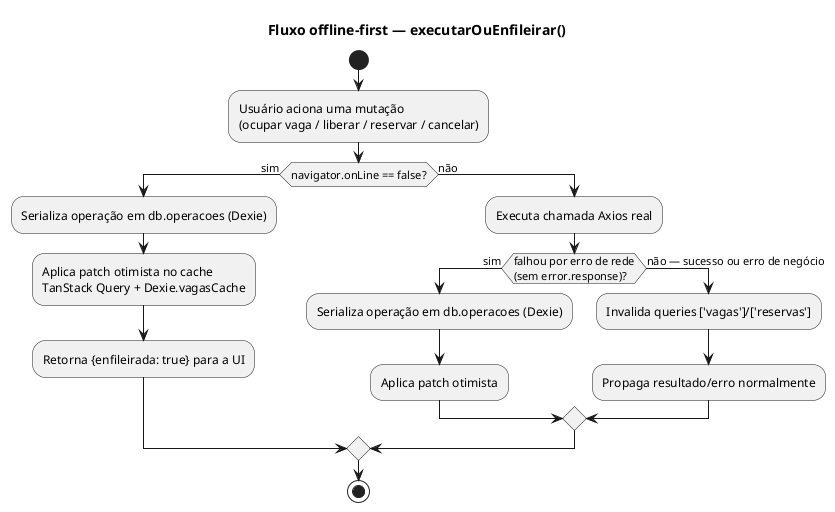

Quando o navegador dispara o evento `online` (ou ao montar o app já online), `sincronizarPendentes()`
(`offline/sync.ts:27-62`) envia **todo o lote pendente em uma única chamada** para
`POST /movimentacoes/sync`. O backend processa cada item independentemente (ver seção 8.7 — fluxo de
tratamento de exceções); a resposta traz um resultado por item, e o cliente remove da fila apenas os
que tiveram sucesso, incrementando `tentativas` e guardando a mensagem de erro dos que falharam (para
retry manual via o botão "Sincronizar agora" em `StatusConexao.tsx`).

### 4.6 Componentes — responsabilidade de cada um

| Componente | Responsabilidade |
|---|---|
| `Layout` | Casca visual (cabeçalho, navegação condicionada por `useIsAdmin`, logout, `StatusConexao`) |
| `VagaCard` | Card de uma vaga: status, ocupante/reserva atual, ação (ocupar/liberar) conforme `status` |
| `EntradaModal` | Formulário modal de registro de entrada (nome, placa, veículo, tipo de cliente, observações) |
| `ReservaForm` | Formulário de nova reserva, com `<select>` de vagas livres |
| `StatusConexao` | Indicador online/offline + contagem de operações pendentes no Dexie (`useLiveQuery`) + botão de sync manual |
| `StatTile` | Tile numérico simples (KPI) usado no dashboard de relatórios |
| `charts/StatusVagasChart` | Gráfico de barras horizontal (Recharts) — contagem de vagas por status |
| `charts/HistoricoChart` | Gráfico de linha (Recharts) — entradas/saídas por dia |
| `components/ui/*` | Primitivos shadcn/ui (`Button`, `Input`, `Label`, `Select`, `Dialog`, `Badge`) sobre Radix + CVA |

### 4.7 PWA

`vite-plugin-pwa` gera manifest (nome, ícones 192/512px, tema escuro) e service worker via Workbox
(`vite.config.ts:9-37`), com `registerType: 'autoUpdate'` e uma regra de cache em runtime
(`NetworkFirst` para requisições cujo host bate com o regex `/^https:\/\/api\./`). Ver observação
sobre esse regex na seção de limitações.

---

## 5. Banco de dados

### 5.1 Tabelas

Todas as 7 tabelas usam **tipos genéricos do SQLAlchemy** (`String`, `Integer`, `Boolean`, `DateTime`,
`Text`, `Enum`) — nenhum tipo dialect-specific foi encontrado em nenhum modelo, confirmando a regra
de compatibilidade MySQL↔PostgreSQL do `PROJECT_SPEC.md` como efetivamente seguida no código.

| Tabela | PK | FKs | Colunas notáveis | Observação |
|---|---|---|---|---|
| `vagas` | `id` (String(20), chave natural, ex. `"S2-49"`) | — | `status` (enum `status_vaga`: livre/ocupada/reservada/manutencao), `ativo` (bool) | `ativo=false` é **soft-delete** — `DELETE /vagas/{id}` nunca remove a linha |
| `ocupantes` | `id` (Integer, autoincrement) | `vaga_id → vagas.id` | `tipo_cliente` (enum), `hora_entrada`, `operador_id` (string livre — `sub` do Auth0) | Ver nota de integridade abaixo |
| `reservas` | `id` (Integer, autoincrement) | `vaga_id → vagas.id` | `status` (String livre: `ativa`/`concluida`/`cancelada`/`expirada`), `canal` (`webapp`/`whatsapp`) | `status` não é um `Enum` de banco, é convenção de aplicação |
| `movimentacoes` | `id` (Integer, autoincrement) | `vaga_id → vagas.id` | `tipo` (`entrada`/`saida`), `tempo_permanencia_min` (nullable), `sincronizado` (bool, default true) | Ver nota sobre `sincronizado` abaixo |
| `audit_logs` | `id` (Integer, autoincrement) | — (nenhuma FK; `usuario_id` é string livre) | `detalhes` (Text, JSON serializado manualmente via `json.dumps`) | Ver nota de cobertura de auditoria abaixo |
| `dominios_autorizados` | `dominio` (String, chave natural) | — | `ativo` (bool) | Consultada pela Auth0 Post-Login Action |
| `admin_emails` | `email` (String, chave natural) | — | — | Consultada pela Auth0 Post-Login Action |

Não existe uma tabela local de usuários/contas — a identidade é inteiramente delegada ao Auth0; o
backend nunca persiste um "usuário", apenas referências textuais ao `sub` (ou ao e-mail, nas listas de
autorização).

### 5.2 Diagrama Entidade-Relacionamento

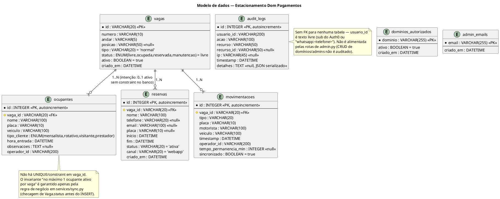

### 5.3 Migrações (Alembic)

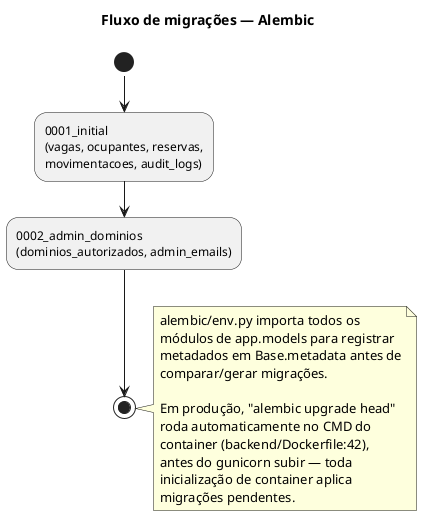

### 5.4 Representação ORM

SQLAlchemy 2.0 estilo declarativo (`Mapped[T]` + `mapped_column(...)`), uma classe por tabela, todas
herdando de `Base(DeclarativeBase)` (`app/models/base.py`). Enums Python (`StatusVaga`, `TipoCliente`)
são declarados nos próprios módulos de modelo e mapeados via `sqlalchemy.Enum(..., name=...)` —
portáveis entre MySQL e PostgreSQL porque o SQLAlchemy emula o tipo quando o dialeto não o suporta
nativamente (MySQL não tem `ENUM` nomeado como PostgreSQL, mas o SQLAlchemy compensa isso).

---

## 6. Infraestrutura e deploy

### 6.1 Desenvolvimento local

`docker-compose.yml` (raiz) sobe 4 serviços: `mysql:8.0` (com healthcheck), `redis:7-alpine`
(protegido por senha), `backend` (build local, `--reload`, volume bind-mount do código) e `frontend`
(build local, servido por nginx na porta 3000). Um `docker-compose.yml` **separado** em
`evolution-api/` sobe uma instância local da Evolution API + Postgres + Redis próprios, para testes
de integração do WhatsApp — o próprio arquivo documenta que não é para produção
(`evolution-api/docker-compose.yml:3-4`).

### 6.2 Build

* **Backend**: `Dockerfile` multi-stage — estágio `builder` (`python:3.12-slim` + `build-essential`
  + `libffi-dev`) compila um virtualenv (`/opt/venv`) a partir de `requirements.txt`; estágio final
  copia apenas o venv + as bibliotecas nativas de runtime do weasyprint (`libpango`, `libpangocairo`,
  `libgdk-pixbuf`, `libcairo2`, `fonts-liberation`) + `curl` (para o `HEALTHCHECK`), roda como usuário
  não-root `appuser` (uid 1000).
* **Frontend**: `Dockerfile` multi-stage — `node:20-alpine` roda `npm ci && npm run build`
  (build args `VITE_API_URL`/`VITE_AUTH0_DOMAIN`/`VITE_AUTH0_CLIENT_ID`/`VITE_AUTH0_AUDIENCE` — essas
  variáveis são **compiladas estaticamente no bundle**, portanto uma mudança exige rebuild, não
  apenas restart); o resultado (`dist/`) é servido por `nginx:alpine` com fallback de SPA
  (`try_files ... /index.html`) e cache imutável de 1 ano para `/assets/`.

### 6.3 Processo de migração do banco

A migração **não é um passo manual de deploy** — é parte do `CMD` do container backend:
```
alembic upgrade head && gunicorn app.main:app --worker-class uvicorn.workers.UvicornWorker --workers 4 --bind 0.0.0.0:${PORT:-8000}
```
Ou seja, toda vez que o container backend inicia (deploy novo ou restart), migrações pendentes são
aplicadas **antes** do servidor HTTP começar a aceitar tráfego (`backend/Dockerfile:42-44`).

### 6.4 Inicialização da aplicação e execução em produção

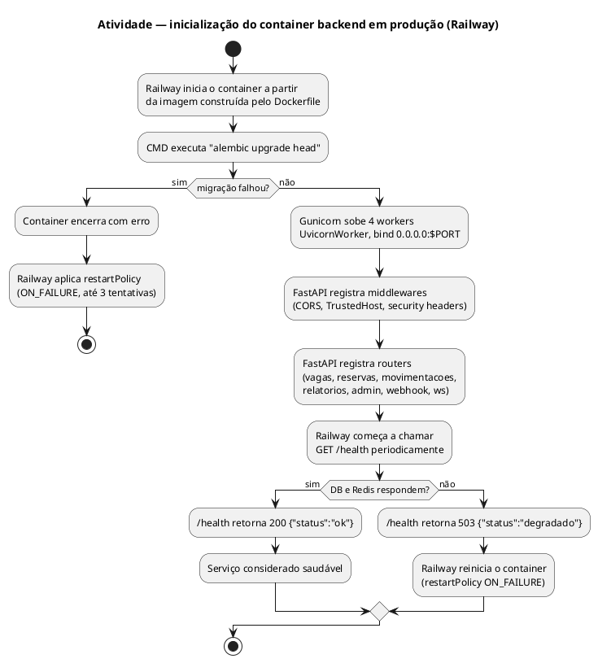

Não há nenhuma tarefa em background/scheduler embutida no processo Python — os dois "cron jobs" do
sistema (expirar reservas vencidas, disparar relatório diário) são **endpoints HTTP comuns**
acionados por um agendador externo (Railway Cron Job fazendo `curl` com o header `X-Cron-Secret`).
O backend, por si só, não tem noção de tempo agendado.

### 6.5 Topologia de deploy (Railway)

Ver diagrama de implantação completo na seção 7.6. Resumo textual:

* **3 serviços a partir deste repositório**: `backend` (root dir `backend`), `frontend` (root dir
  `frontend`), ambos com builder Dockerfile + healthcheck (`/health` e `/`, respectivamente) e
  `restartPolicyType = ON_FAILURE` (`backend/railway.toml`, `frontend/railway.toml`).
* **Evolution API**: deployada a partir do **template oficial do Railway** (não deste repositório),
  com um Postgres e um Redis próprios, e um **Volume Railway persistente** montado em
  `/evolution/instances` — sem isso, a sessão do WhatsApp (QR code escaneado) é perdida a cada
  redeploy (`DEPLOY.md:92-97`).
* **2 plugins gerenciados do Railway** usados pelo `backend`: PostgreSQL e Redis (referenciados via
  `${{Postgres.DATABASE_URL}}` / `${{Redis.REDIS_URL}}`).
* **Normalização de `DATABASE_URL`** (`app/config.py:17-30`): aceita a URL crua do plugin Railway
  (`postgres://` ou `postgresql://`, sem driver assíncrono) e a reescreve para
  `postgresql+asyncpg://` (ou `mysql://` → `mysql+aiomysql://`) — mecanismo que permite colar a
  variável do Railway sem edição manual.
* **Variáveis de ambiente** (ver lista completa em `.env.example`): banco, Redis, ambiente/porta,
  Auth0, Evolution API, Resend, `CRON_SECRET`, `AUTH0_ACTION_SECRET`, e as `VITE_*` (build-time, só
  no frontend).
* **Bootstrap obrigatório e único**: nada consegue logar até existir ao menos uma linha em
  `dominios_autorizados` (e tipicamente em `admin_emails`) — `scripts/seed_admin.py`, rodado uma vez
  via `railway run --service backend python -m scripts.seed_admin --dominio ... --admin ...`
  (`DEPLOY.md:70-77`). Depois disso, o próprio painel `/admin` gerencia o resto.

### 6.6 CI/CD

`.github/workflows/ci.yml` roda em push/PR para `main`, com dois jobs paralelos:

* `backend-tests`: instala as libs nativas do weasyprint, `pip install -r requirements.txt`, `pytest -q`.
* `frontend-build`: `npm ci`, `npm run build` (que roda `tsc -b && vite build` — ou seja, também
  valida os tipos TypeScript).

**Não há job de deploy (CD) neste workflow.** O `DEPLOY.md` é explícito: o deploy real depende de
conectar o repositório no dashboard do Railway (ação manual, feita uma vez, fora do controle de
versão) — cada push em `main` então dispara um build/deploy automático do lado do Railway, mas isso
não está codificado como um step de Actions neste repositório.

---

## 7. Diagramas UML obrigatórios

### 7.1 Diagrama de Componentes

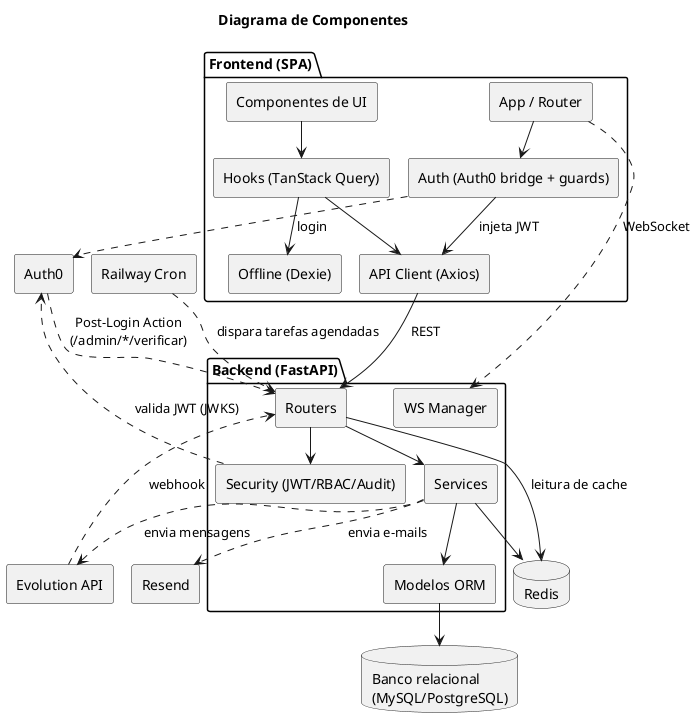

### 7.2 Diagrama de Classes

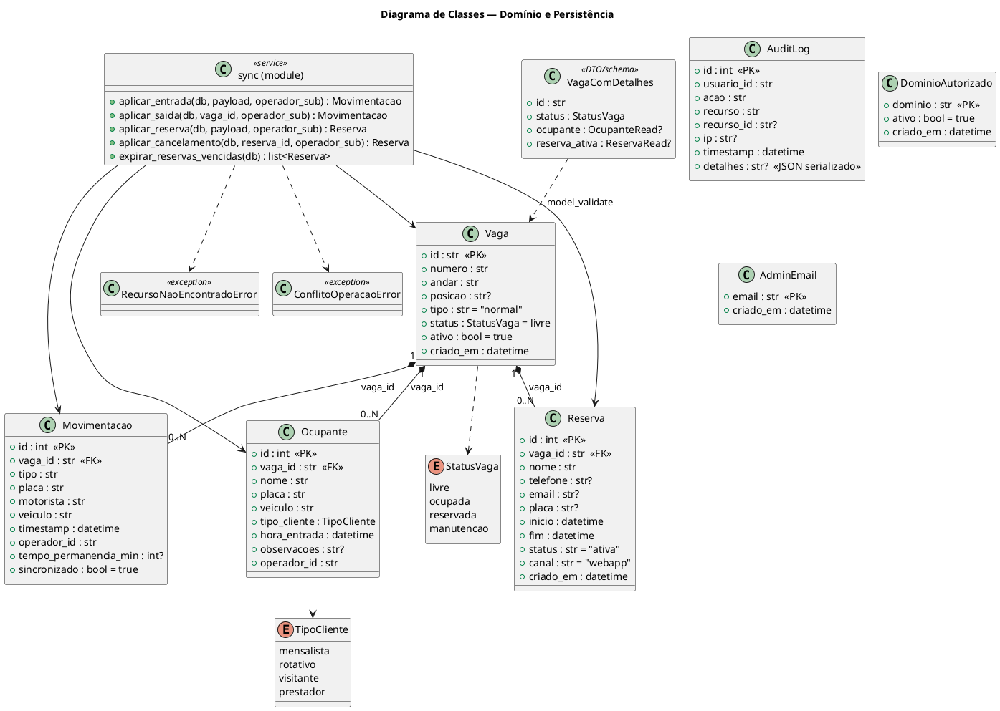

*Nota de fidelidade:* `SyncService` representa o módulo `app/services/sync.py`, que no código é um
conjunto de funções de módulo (não uma classe Python). A notação de classe com métodos "estáticos" é
usada aqui apenas como convenção de representação UML — não existe uma classe `Sync`/`SyncService`
literal no código.

### 7.3 Diagrama de Pacotes

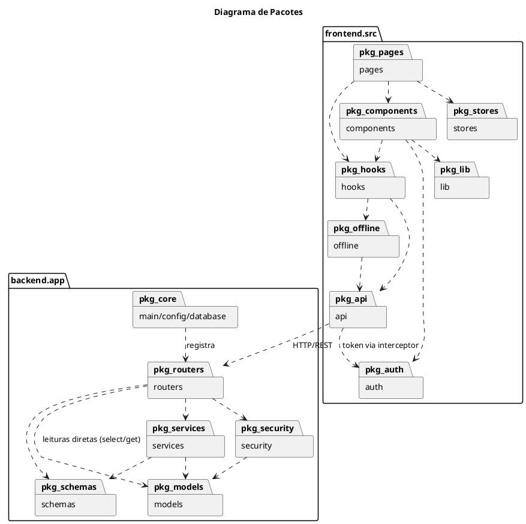

### 7.4 Diagrama de Casos de Uso

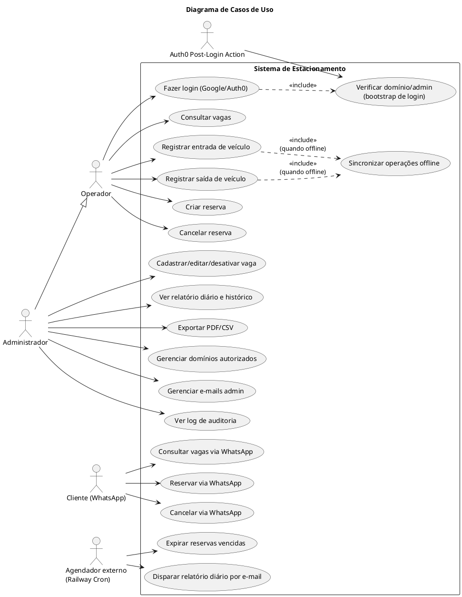

### 7.5 Diagrama de Atividades — ver seção 8 (tratamento de exceções e inicialização), e seção 4.5
(fluxo offline).

### 7.6 Diagrama de Implantação (Deployment)

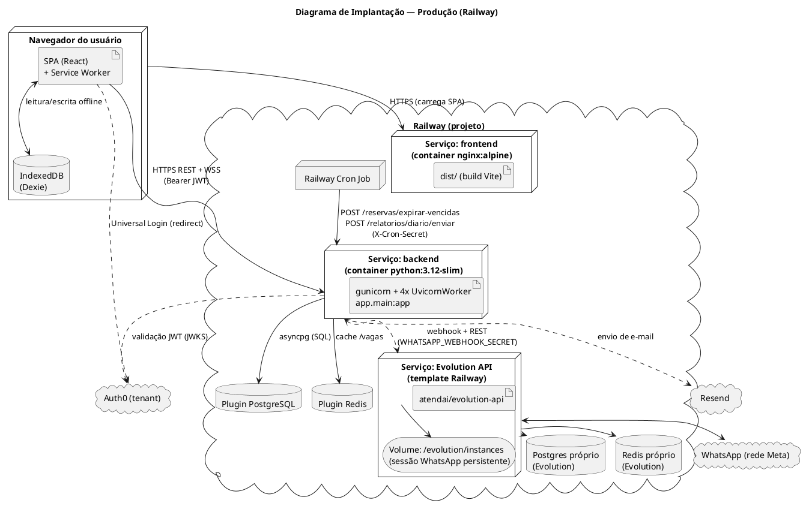

---

## 8. Diagramas de fluxo de dados

### 8.1 Fluxo completo de requisição (consulta de vagas, ilustra cache)

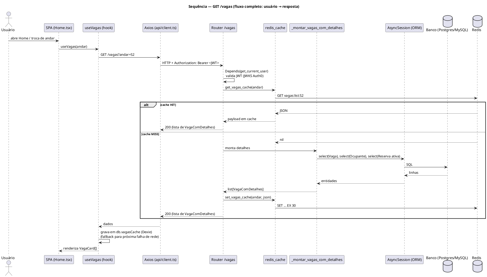

### 8.2 Fluxo de autenticação

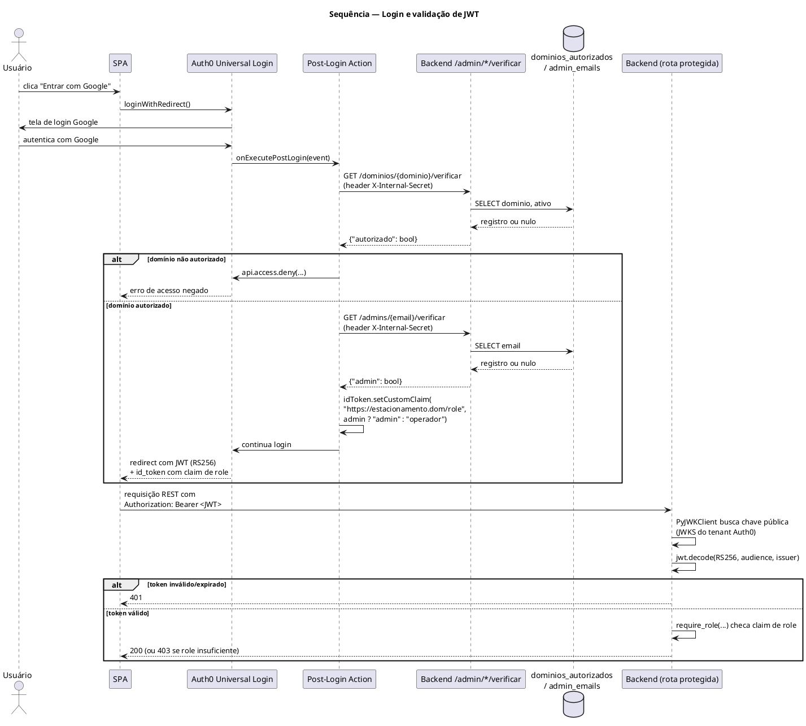

### 8.3 Fluxo de criação — registrar entrada de veículo

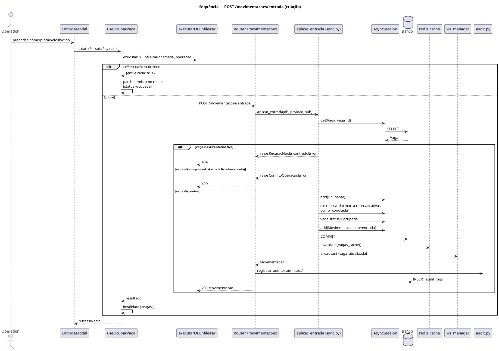

### 8.4 Fluxo de atualização — editar vaga (admin)

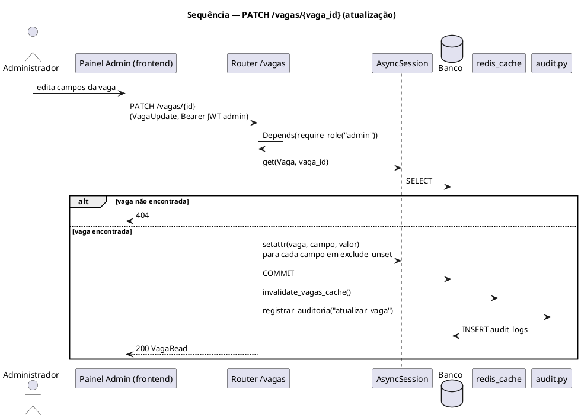

### 8.5 Fluxo de exclusão — desativar vaga (soft delete)

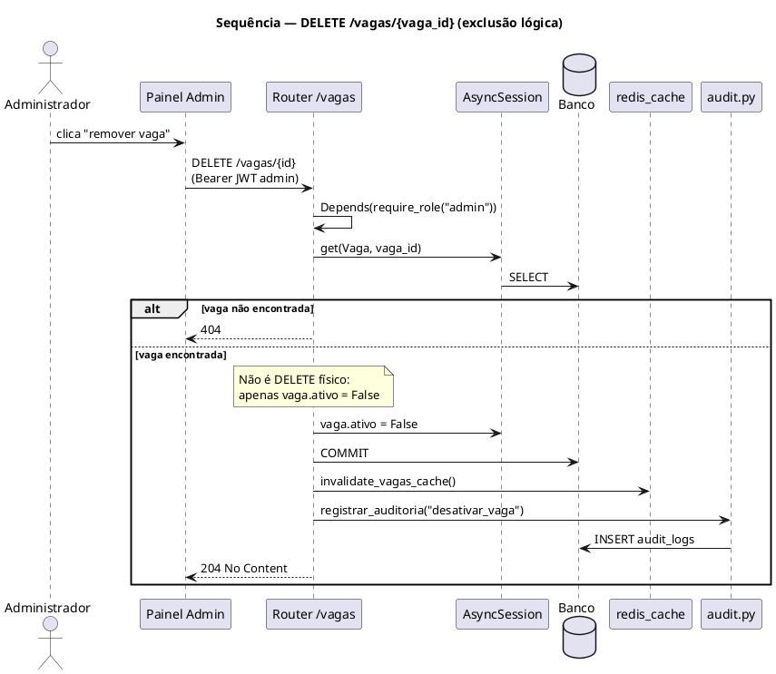

### 8.6 Fluxo de consultas — histórico de movimentações (filtro)

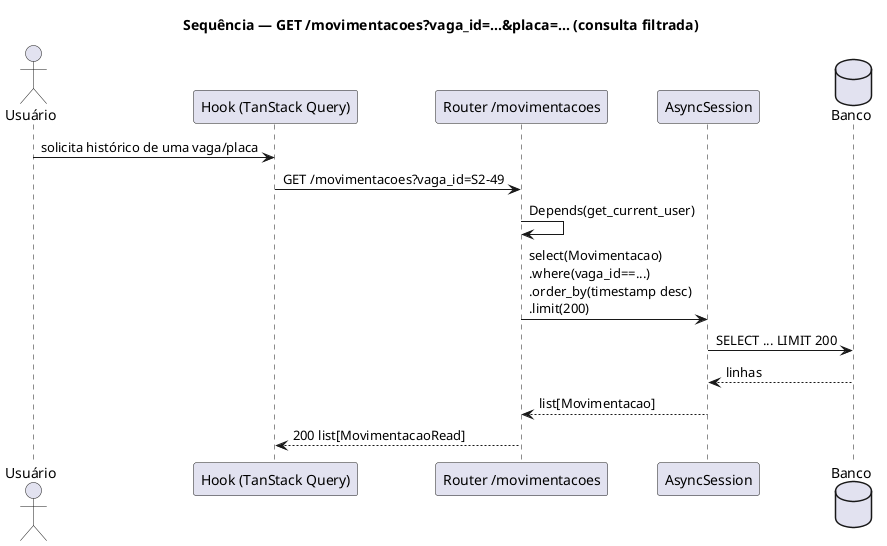

### 8.7 Fluxo de tratamento de exceções — sincronização em lote

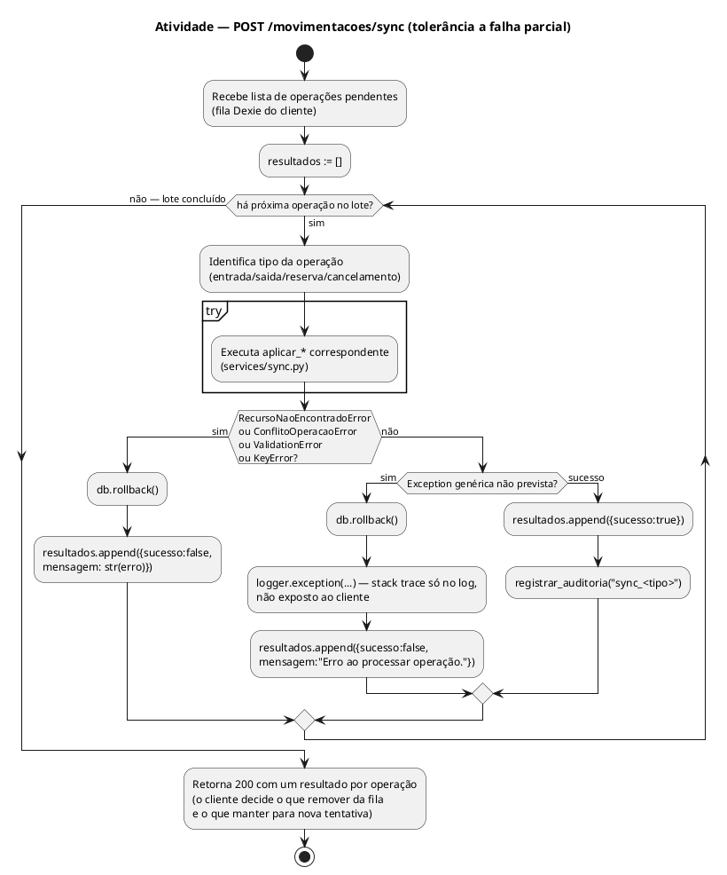

**Raciocínio:** este é o único ponto do backend onde o tratamento de exceção é multi-nível e
explícito por design (`routers/movimentacoes.py:100-124`) — cada operação do lote é isolada (uma
falha não aborta as demais), com `rollback()` por item para não vazar estado parcial de uma operação
com falha para a próxima. Fora deste endpoint, o padrão do resto do backend é mais simples: exceções
de domínio (`RecursoNaoEncontradoError`/`ConflitoOperacaoError`) → `HTTPException` 404/409 (ver seções
8.3–8.5); qualquer outra exceção não tratada sobe para o handler padrão do FastAPI/Starlette (500, sem
handler customizado registrado em `main.py`).

### 8.8 Fluxo de inicialização da aplicação

Ver diagrama de atividade completo na seção 6.4.

---

## Limitações, divergências e perguntas em aberto

Itens abaixo **não puderam ser confirmados apenas pela leitura do código**, ou representam uma
divergência entre a intenção documentada em `PROJECT_SPEC.md` e o que o código efetivamente faz. Cada
um é sinalizado para que um desenvolvedor humano confirme antes de tratá-lo como fato ou como bug:

1. **Sem camada de Repositório explícita.** O acesso a dados é feito diretamente via `AsyncSession`
   dentro de routers e services. Isso é uma observação estrutural, não um erro — mas significa que
   não existe um ponto único para trocar a estratégia de persistência ou adicionar testes de
   contrato de repositório.
2. **Sem Use Cases como classes.** As regras de negócio estão em funções de módulo
   (`services/sync.py`). Funcionalmente equivalente a um caso de uso, mas não modelado como tal no
   código.
3. **Integridade "1 ocupante ativo por vaga" não é garantida pelo banco.** Não há `UNIQUE` em
   `ocupantes.vaga_id`; o invariante depende inteiramente da checagem de `Vaga.status` em
   `aplicar_entrada` (`services/sync.py:24-29`). Uma escrita concorrente sem passar por essa função,
   ou uma condição de corrida entre duas requisições simultâneas na mesma vaga, poderia (em teoria)
   criar dois registros de `ocupantes` para a mesma vaga — não foi possível confirmar se há algum
   lock/transação adicional que previna isso, pois não há teste de concorrência no diretório `tests/`.
4. **Coluna `movimentacoes.sincronizado` parece vestigial.** Existe na migração e no modelo (default
   `True`), mas nenhuma função em `services/sync.py` ou nos routers lidos altera esse valor para
   `False`, nem há leitura desse campo em nenhum filtro de consulta encontrado. A reconciliação
   "offline vs. já sincronizado" é feita inteiramente no cliente (Dexie), não neste campo do servidor.
   Não é possível confirmar, sem o autor do código, se essa coluna é um remanescente de um design
   anterior ou se está reservada para uso futuro.
5. **CRUD de `admin.py` não gera `audit_logs`.** Ao contrário de `vagas.py`/`reservas.py`/
   `movimentacoes.py`, nenhuma rota de `admin.py` (criar/remover domínio, criar/remover admin) chama
   `registrar_auditoria`. Ou seja, a tabela de auditoria existe, mas mudanças no controle de acesso
   (potencialmente a categoria mais sensível de mudança) não ficam auditadas.
6. **Regra de "upsert portátil via `session.merge()`"** (`PROJECT_SPEC.md`) **não encontrada no
   código lido.** Os pontos de criação observados usam `db.get(...)` seguido de `db.add(...)`
   condicional (ex.: `routers/admin.py:44-52`), não `session.merge()`. Pode ser que a regra do spec
   se refira a um padrão pretendido para código futuro, não implementado até este ponto.
7. **"Logging estruturado"** (regra do `PROJECT_SPEC.md`) — o `logging.basicConfig` usado
   (`main.py:15-18`) produz texto plano formatado, não JSON estruturado. Não há biblioteca de logging
   estruturado (ex. `structlog`, `python-json-logger`) nas dependências (`requirements.txt`).
8. **Regex de cache do Service Worker (`vite.config.ts:28`)** — `urlPattern: /^https:\/\/api\./`
   só casa origens que **literalmente começam com** `https://api.`. Se o domínio de produção do
   backend for o padrão gerado pelo Railway (ex. `algo.up.railway.app`, sem o subdomínio `api.`), essa
   regra de cache `NetworkFirst` nunca seria acionada — não foi possível confirmar qual será o domínio
   final de produção, pois isso depende de configuração feita fora do repositório (painel Railway).
9. **Papel exato de `pymysql` nas dependências** (`requirements.txt:9`) — o driver assíncrono
   efetivamente configurado para MySQL é `aiomysql` (`config.py:15`); não foi possível confirmar pela
   leitura do código se `pymysql` é usado por alguma dependência transitiva (possivelmente pelo
   Alembic em algum caminho síncrono) ou se é uma dependência não utilizada.
10. **Testes automatizados de frontend não existem**, apesar de `package.json` declarar
    `"test": "vitest run"` e o `PROJECT_SPEC.md` mencionar "Jest para componentes React críticos" — a
    busca por arquivos `*.test.*`/`*.spec.*` em `frontend/src` não retornou nenhum resultado. O
    workflow de CI também não roda nenhum comando de teste de frontend, apenas `npm run build`.
11. **Nenhuma tabela local de usuários.** A ausência de uma entidade "Usuário" no banco é uma
    característica de design (identidade 100% delegada ao Auth0), não uma omissão — mas é importante
    deixar explícito, já que o enunciado deste levantamento pergunta por entidades de domínio: não
    existe uma entidade `Usuario`/`Account` para modelar.
12. **Comportamento de infraestrutura externa não verificável estaticamente**: o conteúdo real da
    Auth0 Post-Login Action em produção, a configuração exata do template Railway da Evolution API, e
    o estado atual dos secrets/variáveis no dashboard Railway não são visíveis a partir do
    repositório — a documentação das seções 2, 3.6 e 6 sobre esses pontos reflete o que
    `PROJECT_SPEC.md`/`DEPLOY.md` descrevem como *intenção de configuração*, cruzado com o que o
    *código do backend* de fato consome (variáveis de ambiente, formato de headers) — não uma
    inspeção do painel em si.

Caso alguma dessas hipóteses precise ser resolvida com certeza (por exemplo, para decidir se o item 3
ou o item 4 é um bug a corrigir), recomenda-se confirmar com quem escreveu o código original ou
revisar o histórico de commits/PRs correspondente.
